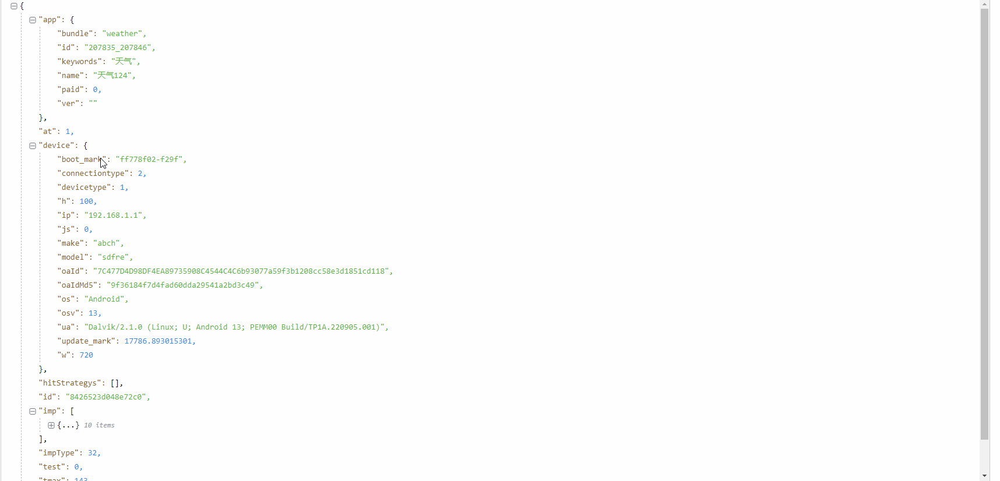

# json-view-v2

自定义 JsonKey 功能预览


vue2.x 版本 用于展示 JSON 的 vue 插件
主要功能:

- 支持折叠/展开
- 支持配置默认展开层数
- 支持配置折叠按钮颜色
- 可选主主题色 one-dark、vs-code
- 可配置字体大小
- 可配置行高
- 可自定义配置 JSON 展示的 key 的名称
- .....

## 使用

- 默认用法

```vue
<template>
  <json-view-v2 :data="json" />
</template>
```

- 使用插槽

```vue
<template>
  <json-view-v2 :data="json">
    <template v-slot:key="{ data }">
      <span :title="getDict(data.positionKeys).desc"
        >{{ data.jsonKey
        }}<span v-if="getDict(data.positionKeys)"
          >（{{ getDict(data.positionKeys).name }}）</span
        ></span
      >
    </template>
  </json-view-v2>
</template>
```

## props

| 属性            | 说明                                                            | 类型    | 默认值                                                                     |
| --------------- | --------------------------------------------------------------- | ------- | -------------------------------------------------------------------------- |
| json            | 传入的 json 数据（必填）                                        | Object  | -                                                                          |
| closed          | 是否折叠全部                                                    | Boolean | false                                                                      |
| deep            | 展开深度,越大渲染速度越慢,建议不超过 5                          | Number  | 3                                                                          |
| icon-style      | 折叠按钮样式，可选值为 square、circle、triangle                 | String  | square                                                                     |
| icon-color      | 两个折叠按钮的颜色                                              | Array   | theme=vs-code 时，['#c6c6c6', '#c6c6c6']，其他情况为['#747983', '#747983'] |
| theme           | 可选主题样式,可选值为 one-dark、vs-code，不选时为默认的白色主题 | String  | 白色                                                                       |
| font-size       | 字体大小,单位 px                                                | Number  | 14                                                                         |
| line-height     | 行高，单位 px                                                   | Number  | 24                                                                         |
| string-auto-json | 是否自动 parse 字段值为 stringify 的 json 串为 json             | Boolean | false                                                                      |

**注：行高和字体大小不建议选用过大值，因为 icon 大小、每行的 padding-left 等参数并不会随之发生改变**

## JsonKey Scoped Slot

| name | 说明                                                                                                                |
| ---- | ------------------------------------------------------------------------------------------------------------------- |
| key  | 自定义 Key 的内容. 参数为 data, 可解构出 { positionKeys, jsonKey },其中: positionKeys 为一个祖先节点(包括自身)key 按顺序组成的数组 |

